# HealthLink Pro v2.0 - Master Architecture Diagram

## System Overview

```mermaid
graph TB
    subgraph "Users"
        U1[👨‍⚕️ Doctor]
        U2[🧑‍⚕️ Patient]
        U3[👔 Admin]
        U4[🏛️ Government]
    end

    subgraph "Frontend Layer - Port 9002"
        FE[Next.js 15 Frontend<br/>React 19 + TypeScript<br/>Tailwind CSS + shadcn/ui]
        FE_AUTH[Auth Context<br/>JWT Token Management]
        FE_API[API Client<br/>Token Interceptor]
    end

    subgraph "Middleware Layer - Port 4000"
        MW[Node.js Express API<br/>REST Endpoints]
        MW_AUTH[Auth Middleware<br/>JWT Verification]
        MW_ROUTES[Route Controllers<br/>- Auth<br/>- Medical Records<br/>- Prescriptions<br/>- Consents<br/>- Appointments]
        MW_SERVICES[Business Services<br/>- auth.service.js<br/>- db.service.js<br/>- fabricGateway.service.js]
    end

    subgraph "Data Persistence Layer"
        subgraph "Supabase PostgreSQL"
            SB_USERS[users table<br/>- email, password_hash<br/>- role, profile metadata<br/>- fabric_enrollment_id]
            SB_AUDIT[user_audit_log table<br/>- login/logout events<br/>- IP addresses<br/>- timestamps]
        end
        
        subgraph "Hyperledger Fabric Network"
            FB_CHANNEL[Channel: mychannel]
            FB_PEER1[Peer0.Org1<br/>Port 7051]
            FB_PEER2[Peer0.Org2<br/>Port 9051]
            FB_ORDERER[Orderer<br/>Port 7050]
            FB_LEDGER[(Blockchain Ledger<br/>Immutable Records)]
            
            subgraph "Chaincodes Smart Contracts"
                CC1[patient-records-contract]
                CC2[prescription-contract]
                CC3[consent-contract]
                CC4[appointment-contract]
                CC5[lab-test-contract]
                CC6[doctor-credentials-contract]
            end
        end
        
        subgraph "Content-Addressable Storage"
            CAS[(Local File System<br/>Encrypted Files<br/>- PDFs<br/>- DICOM images<br/>- Lab results)]
        end
    end

    %% User to Frontend
    U1 -->|HTTPS| FE
    U2 -->|HTTPS| FE
    U3 -->|HTTPS| FE
    U4 -->|HTTPS| FE

    %% Frontend Internal
    FE --> FE_AUTH
    FE_AUTH --> FE_API

    %% Frontend to Middleware
    FE_API -->|REST API<br/>Bearer Token| MW

    %% Middleware Internal
    MW --> MW_AUTH
    MW_AUTH --> MW_ROUTES
    MW_ROUTES --> MW_SERVICES

    %% Middleware to Supabase
    MW_SERVICES -->|User Authentication| SB_USERS
    MW_SERVICES -->|Audit Logging| SB_AUDIT

    %% Middleware to Fabric
    MW_SERVICES -->|Gateway SDK| FB_CHANNEL
    FB_CHANNEL --> FB_PEER1
    FB_CHANNEL --> FB_PEER2
    FB_CHANNEL --> FB_ORDERER
    FB_PEER1 --> FB_LEDGER
    FB_PEER2 --> FB_LEDGER
    FB_ORDERER --> FB_LEDGER
    
    %% Fabric Chaincodes
    FB_PEER1 --> CC1
    FB_PEER1 --> CC2
    FB_PEER1 --> CC3
    FB_PEER1 --> CC4
    FB_PEER1 --> CC5
    FB_PEER1 --> CC6

    %% Middleware to CAS
    MW_SERVICES -->|File Storage<br/>IPFS Hash| CAS

    %% Styling
    classDef userStyle fill:#e1f5ff,stroke:#01579b,stroke-width:2px
    classDef frontendStyle fill:#fff3e0,stroke:#e65100,stroke-width:2px
    classDef middlewareStyle fill:#f3e5f5,stroke:#4a148c,stroke-width:2px
    classDef dbStyle fill:#e8f5e9,stroke:#1b5e20,stroke-width:2px
    classDef blockchainStyle fill:#fff9c4,stroke:#f57f17,stroke-width:2px
    classDef storageStyle fill:#fce4ec,stroke:#880e4f,stroke-width:2px

    class U1,U2,U3,U4 userStyle
    class FE,FE_AUTH,FE_API frontendStyle
    class MW,MW_AUTH,MW_ROUTES,MW_SERVICES middlewareStyle
    class SB_USERS,SB_AUDIT dbStyle
    class FB_CHANNEL,FB_PEER1,FB_PEER2,FB_ORDERER,FB_LEDGER,CC1,CC2,CC3,CC4,CC5,CC6 blockchainStyle
    class CAS storageStyle
```



---

## Data Flow: User Login


---

## Data Flow: Create Medical Record

```mermaid
sequenceDiagram
    participant D as 👨‍⚕️ Doctor Browser
    participant FE as Next.js Frontend
    participant MW as Node.js Middleware
    participant CAS as Content-Addressable Storage
    participant FB as Hyperledger Fabric
    participant SB as Supabase (Auth Only)

    D->>FE: Upload diagnosis + PDF file
    FE->>MW: POST /api/medical-records<br/>Authorization: Bearer <token>
    MW->>MW: Verify JWT token
    MW->>SB: Lookup user by fabric_enrollment_id
    SB-->>MW: User profile (verify doctor role)
    MW->>CAS: Encrypt and store PDF
    CAS-->>MW: IPFS hash (content address)
    MW->>FB: submitTransaction()<br/>'CreatePatientRecord'<br/>{recordId, doctorId, ipfsHash, metadata}
    FB->>FB: Endorsement by Peers
    FB->>FB: Ordering by Orderer
    FB->>FB: Validation & Commit
    FB-->>MW: Transaction ID + Result
    MW-->>FE: {recordId, txId, ipfsHash}
    FE-->>D: ✅ Record created successfully
    
    Note over D,SB: Medical data NEVER touches Supabase<br/>Only blockchain + encrypted storage
```



---

## Data Separation Table

| Data Category | Supabase PostgreSQL | Hyperledger Fabric | CAS Storage |
|---------------|---------------------|---------------------|-------------|
| **User Credentials** | ✅ email, password_hash | ❌ | ❌ |
| **User Profiles** | ✅ name, phone, avatar | ❌ | ❌ |
| **Login History** | ✅ last_login_at | ❌ | ❌ |
| **Audit Logs (Auth)** | ✅ user_audit_log | ❌ | ❌ |
| **Doctor Licenses** | ✅ license_number | ❌ | ❌ |
| **Patient Records Metadata** | ❌ | ✅ recordId, doctorId, timestamp | ❌ |
| **Prescriptions** | ❌ | ✅ medications, dosages | ❌ |
| **Consents** | ❌ | ✅ patientId, granteeId, scope | ❌ |
| **Appointments** | ❌ | ✅ schedule, status | ❌ |
| **Audit Trail (Medical)** | ❌ | ✅ Blockchain transactions | ❌ |
| **PDF Documents** | ❌ | ❌ | ✅ Encrypted files |
| **DICOM Images** | ❌ | ❌ | ✅ Encrypted files |
| **Lab Results** | ❌ | ❌ | ✅ Encrypted files |

**Critical Rule**: ⚠️ **Medical data NEVER stored in Supabase** - Only user authentication and profile metadata

---

## Technology Stack

### Frontend (Port 9002)
- **Framework**: Next.js 15.1.4 (App Router)
- **UI Library**: React 19
- **Language**: TypeScript 5
- **Styling**: Tailwind CSS + shadcn/ui
- **State Management**: React Context API
- **API Client**: Fetch API with token interceptor

### Middleware (Port 4000)
- **Runtime**: Node.js 18+
- **Framework**: Express.js
- **Language**: JavaScript (ES Modules)
- **Authentication**: JWT (jsonwebtoken)
- **Password Hashing**: bcrypt (10 rounds)
- **Blockchain SDK**: Hyperledger Fabric Node SDK

### Data Persistence
#### Supabase PostgreSQL
- **Purpose**: User authentication and profile metadata
- **Tables**: users, user_audit_log
- **Security**: Row Level Security (RLS), bcrypt password hashing
- **Backup**: Automated point-in-time recovery

#### Hyperledger Fabric
- **Version**: 2.5.x
- **Consensus**: Raft (3 orderers)
- **Organizations**: 2 (Org1, Org2)
- **Peers**: 2 (Peer0.Org1, Peer0.Org2)
- **Channel**: mychannel
- **Chaincodes**: 6 smart contracts (Go)

#### Content-Addressable Storage (CAS)
- **Type**: Local file system
- **Encryption**: AES-256 at rest
- **Addressing**: IPFS-style content hashing
- **Location**: `/var/healthlink/cas/`

---

## Port Configuration

| Service | Port | Protocol | Purpose |
|---------|------|----------|---------|
| **Next.js Frontend** | 9002 | HTTP/HTTPS | User interface |
| **Node.js Middleware** | 4000 | HTTP | REST API |
| **Peer0.Org1** | 7051 | gRPC | Blockchain peer |
| **Peer0.Org2** | 9051 | gRPC | Blockchain peer |
| **Orderer** | 7050 | gRPC | Transaction ordering |
| **CouchDB (Org1)** | 5984 | HTTP | State database |
| **CouchDB (Org2)** | 7984 | HTTP | State database |
| **CA (Org1)** | 7054 | HTTP | Certificate authority |
| **CA (Org2)** | 8054 | HTTP | Certificate authority |
| **Supabase** | 443 | HTTPS | Cloud database |

---

## Security Architecture

### Authentication Flow
1. **Registration**: User → Frontend → Middleware
   - Middleware creates Fabric identity (X.509 cert)
   - Middleware stores credentials in Supabase (bcrypt hash)
   - Returns JWT token (24-hour expiry)

2. **Login**: User → Frontend → Middleware
   - Middleware queries Supabase by email
   - Verifies password with bcrypt.compare()
   - Logs audit event (IP, user agent, timestamp)
   - Returns JWT token

3. **Authorization**: Every API request
   - Frontend sends: `Authorization: Bearer <token>`
   - Middleware verifies JWT signature
   - Middleware extracts userId from payload
   - Middleware checks role permissions

### Data Encryption
- **At Rest**: AES-256 for CAS files
- **In Transit**: TLS 1.3 for all network communication
- **Passwords**: bcrypt with 10 rounds (never stored plaintext)
- **Blockchain**: SHA-256 for block hashing

### Access Control
- **Consent-Based**: Patient must grant consent for doctor access
- **Role-Based**: Patient, Doctor, Admin, Government roles
- **Audit Trail**: All medical record access logged on blockchain
- **Revocation**: Patient can revoke consent anytime

---

## Deployment Architecture

### Development Environment
```
Docker Compose
├── fabric-network (test-network)
│   ├── peer0.org1.example.com
│   ├── peer0.org2.example.com
│   ├── orderer.example.com
│   ├── couchdb0 (Org1 state DB)
│   └── couchdb1 (Org2 state DB)
├── middleware-api (Node.js)
│   └── Port 4000
└── frontend (Next.js)
    └── Port 9002
```

### Production Considerations
- **Frontend**: Deploy to Vercel/Netlify (CDN + serverless)
- **Middleware**: Deploy to AWS ECS/Kubernetes (auto-scaling)
- **Fabric**: Deploy to Kubernetes with persistent volumes
- **Supabase**: Managed service (automatic scaling, backups)
- **CAS**: Deploy to S3/Cloudflare R2 with encryption

---

## API Endpoints Summary

### Authentication (`/api/auth`)
- `POST /register` - Create user + Fabric identity
- `POST /login` - Authenticate and get JWT token
- `GET /me` - Get current user profile
- `POST /refresh` - Refresh JWT token
- `POST /change-password` - Update password
- `POST /logout` - Invalidate session

### Medical Records (`/api/medical-records`)
- `POST /` - Create record (submitTransaction)
- `GET /:recordId` - Get record (evaluateTransaction)
- `GET /patient/:patientId` - List patient records
- `GET /doctor/:doctorId` - List doctor records
- `PUT /:recordId` - Update record
- `DELETE /:recordId/archive` - Archive record
- `GET /:recordId/access-log` - View audit trail
- `GET /:recordId/history` - View modification history

### Prescriptions (`/api/prescriptions`)
- `POST /` - Create prescription
- `GET /:prescriptionId` - Get prescription
- `POST /:prescriptionId/dispense` - Mark as dispensed
- `POST /:prescriptionId/refill` - Request refill
- `GET /patient/:patientId` - List patient prescriptions

### Consents (`/api/consents`)
- `POST /` - Grant consent
- `GET /:consentId` - Get consent details
- `PATCH /:consentId/revoke` - Revoke consent
- `GET /patient/:patientId` - List patient consents

### Appointments (`/api/appointments`)
- `POST /` - Schedule appointment
- `GET /:appointmentId` - Get appointment
- `POST /:appointmentId/confirm` - Confirm appointment
- `POST /:appointmentId/complete` - Mark complete
- `POST /:appointmentId/cancel` - Cancel appointment

---

## Monitoring & Observability

### Logs
- **Frontend**: Browser console + Vercel logs
- **Middleware**: Winston logger (JSON format)
- **Fabric**: Peer/orderer logs (Docker logs)
- **Supabase**: Query logs (Supabase Dashboard)

### Metrics
- **API Latency**: Response time for each endpoint
- **Blockchain Performance**: Transaction throughput (TPS)
- **Database Queries**: Query execution time
- **Error Rates**: 4xx/5xx response counts

### Alerts
- **Authentication Failures**: >10 failed logins/minute
- **Blockchain Downtime**: Peer/orderer unavailable
- **Database Errors**: Connection pool exhaustion
- **Disk Space**: CAS storage >80% full

---

**Version**: 2.0  
**Last Updated**: December 5, 2025  
**Status**: Production-Ready
